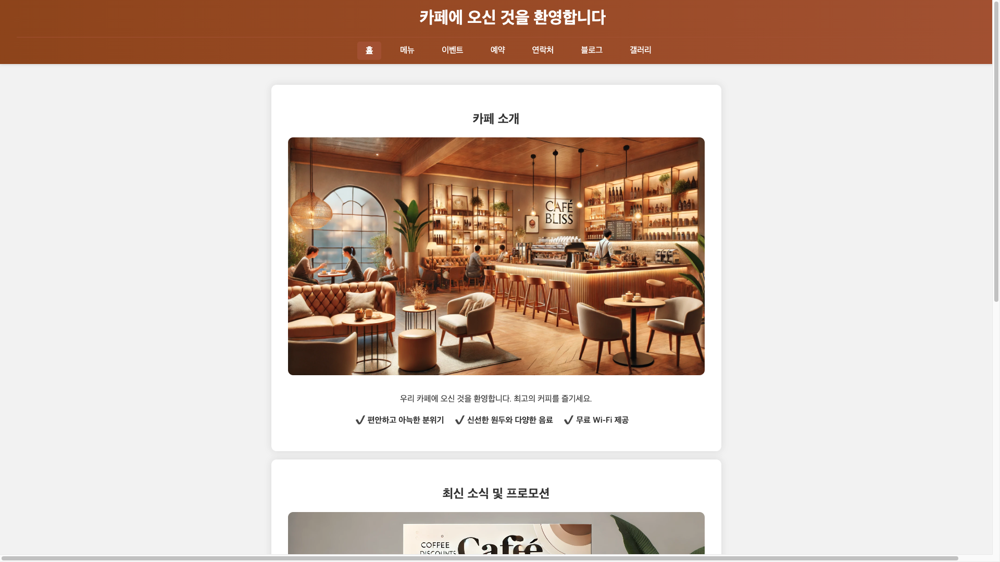
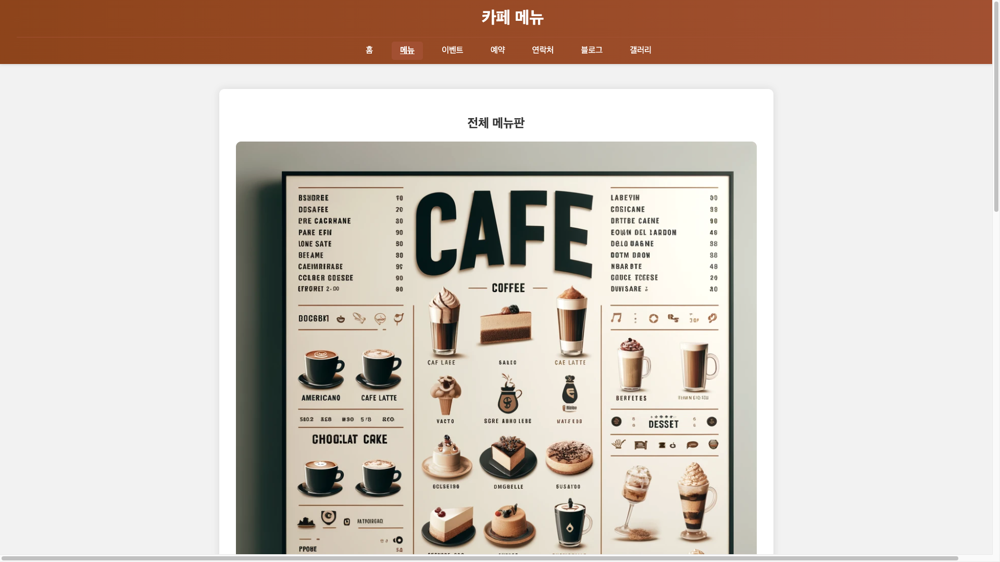
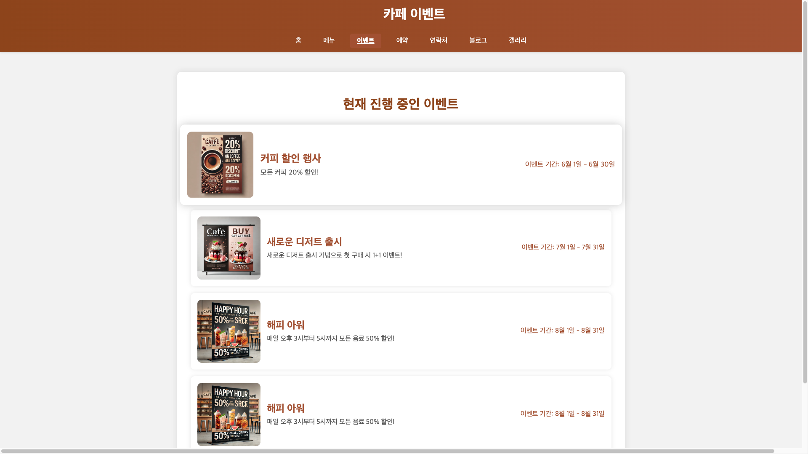
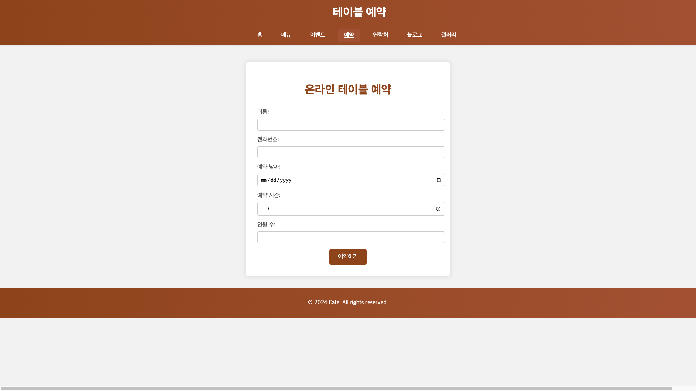
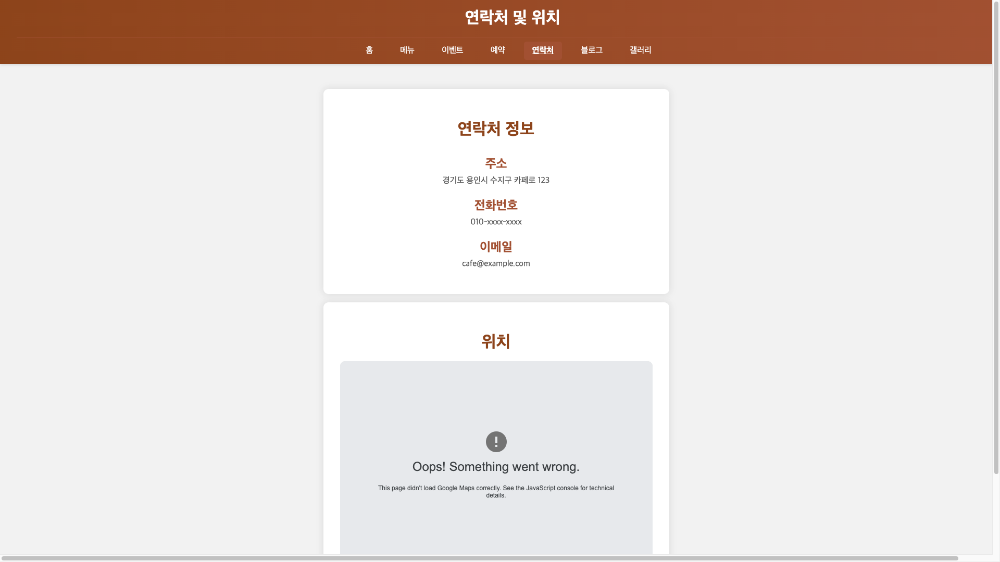
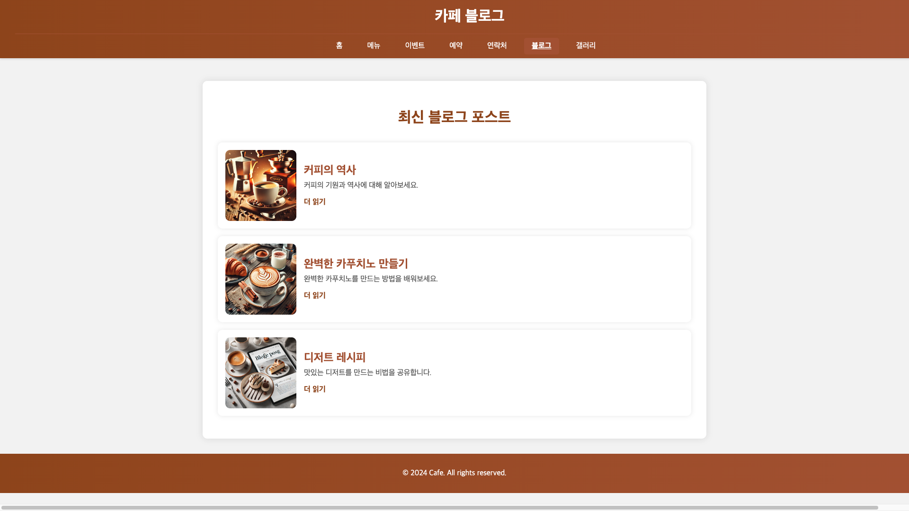
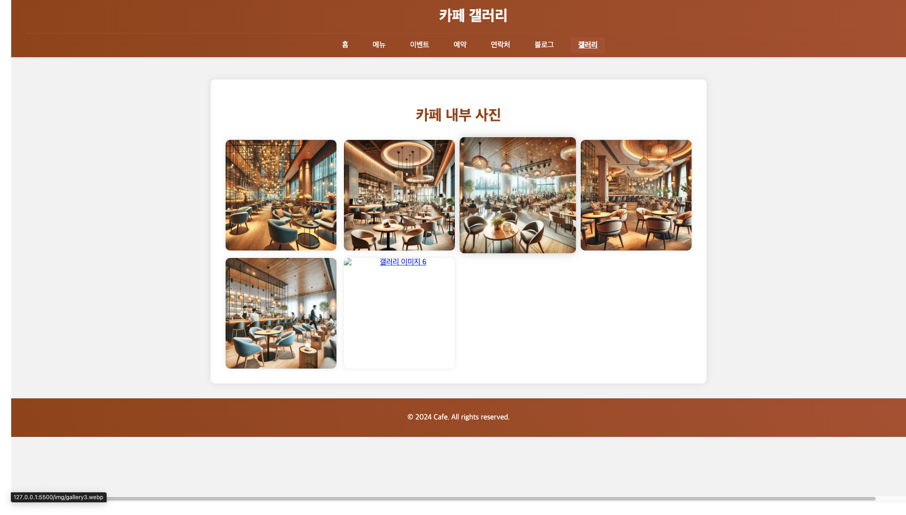

# Cafe

Cafe 프로젝트는 HTML, CSS, 그리고 현대적인 JavaScript만을 사용하여 웹 서버 없이 동작하는 카페 웹 사이트를 만드는 것입니다. 이 프로젝트의 목적은 사용자들에게 직관적이고 매력적인 인터페이스를 제공하여 카페의 메뉴, 위치, 연락처 등을 쉽게 확인할 수 있도록 하는 것입니다. 서버 없이 클라이언트 측 기술만을 사용하여 웹 사이트를 구축함으로써, 웹 개발의 기초를 다지고 프론트엔드 기술을 향상시키는 데 중점을 둡니다.

## 프로젝트 설명

주요 기능
- 홈페이지: 카페 소개, 최신 소식 및 프로모션 배너, 방문자 리뷰
- 메뉴 페이지: 음료 및 음식 메뉴 목록, 각 항목에 대한 상세 설명 및 이미지
- 이벤트 및 프로모션: 현재 진행 중인 이벤트 및 특별 할인 정보
- 예약 시스템: 온라인으로 테이블 예약 기능
- 연락처 및 위치: 카페 주소, 연락처 정보, 지도 표시
- 블로그: 카페 관련 소식, 커피 및 디저트 레시피, 카페 문화 이야기
- 갤러리: 카페 내부 사진, 행사 사진

## 설치 방법

이 프로젝트를 로컬 환경에서 실행하려면, 다음 단계를 따라주세요

1. 이 저장소를 클론합니다.
   ```bash
   git clone 
   ```
2. 프로젝트 디렉토리로 이동합니다.
   ```bash
   cd 
   ```
3. `index.html` 파일을 브라우저에서 엽니다.


## 사용 방법
웹 브라우저에서 `index.html` 파일을 열어 웹사이트를 확인할 수 있습니다.


## 결과 이미지
 | 
 | 

| --- | --- | --- | 

 | 
 |
 | 
 |
| --- | --- | --- | --- |


## 사용 기술
- HTML
- CSS
- Modern JavaScript (ES6+)


## 프로젝트 구조

```plaintext
Cafe/
│
├── index.html          # 홈페이지
├── menu.html           # 메뉴 페이지
├── events.html         # 이벤트 및 프로모션 페이지
├── reservation.html    # 예약 시스템 페이지
├── contact.html        # 연락처 및 위치 페이지
├── blog.html           # 블로그 페이지
├── gallery.html        # 갤러리 페이지
│
├── css/
│   ├── style.css       # 공통 스타일
│   ├── home.css        # 홈페이지 스타일
│   ├── menu.css        # 메뉴 페이지 스타일
│   ├── events.css      # 이벤트 페이지 스타일
│   ├── reservation.css # 예약 시스템 스타일
│   ├── contact.css     # 연락처 페이지 스타일
│   ├── blog.css        # 블로그 페이지 스타일
│   └── gallery.css     # 갤러리 페이지 스타일
│
└── js/
    ├── main.js         # 공통 스크립트
    ├── home.js         # 홈페이지 스크립트
    ├── menu.js         # 메뉴 페이지 스크립트
    ├── events.js       # 이벤트 페이지 스크립트
    ├── reservation.js  # 예약 시스템 스크립트
    ├── contact.js      # 연락처 페이지 스크립트
    ├── blog.js         # 블로그 페이지 스크립트
    └── gallery.js      # 갤러리 페이지 스크립트
```

### 설명

- **index.html:** 홈페이지, 카페 소개, 최신 소식 및 프로모션 배너, 방문자 리뷰를 포함합니다.
- **menu.html:** 카페의 음료 및 음식 메뉴 목록, 각 항목에 대한 상세 설명 및 이미지를 포함합니다.
- **events.html:** 현재 진행 중인 이벤트 및 특별 할인 정보를 제공합니다.
- **reservation.html:** 온라인 테이블 예약 기능을 포함합니다.
- **contact.html:** 카페의 주소, 연락처 정보, 지도 표시 기능을 제공합니다.
- **blog.html:** 카페 관련 소식, 커피 및 디저트 레시피, 카페 문화 이야기를 포함합니다.
- **gallery.html:** 카페 내부 사진 및 행사 사진을 포함합니다.

- **css/:** 스타일 시트 디렉토리로, 각 페이지의 스타일 시트를 포함합니다.
  - **style.css:** 공통 스타일 시트입니다.
  - **home.css, menu.css, events.css, reservation.css, contact.css, blog.css, gallery.css:** 각 페이지별 스타일 시트입니다.

- **js/:** 스크립트 디렉토리로, 각 페이지의 JavaScript 파일을 포함합니다.
  - **main.js:** 공통 스크립트 파일입니다.
  - **home.js, menu.js, events.js, reservation.js, contact.js, blog.js, gallery.js:** 각 페이지별 스크립트 파일입니다.


## 규칙

#### 코딩 컨벤션

1. **파일 및 디렉토리 구조**
   - 파일명은 소문자와 하이픈(-)을 사용합니다. 예: `index.html`, `style.css`, `script.js`
   - 디렉토리명은 소문자와 하이픈(-)을 사용합니다.

2. **HTML**
   - 들여쓰기는 2칸을 사용합니다.
   - 속성명은 소문자를 사용하며, 값은 큰따옴표("")로 감쌉니다.
   - 자주 사용되는 HTML 구조를 주석으로 표시합니다.

3. **CSS**
   - 들여쓰기는 2칸을 사용합니다.
   - 클래스명은 소문자와 하이픈(-)을 사용합니다. 예: `.todo-item`, `.completed`
   - CSS 속성은 알파벳 순으로 정렬합니다.

4. **JavaScript**
   - 들여쓰기는 2칸을 사용합니다.
   - 변수명은 카멜케이스(camelCase)를 사용합니다. 예: `todoItem`, `completedTasks`
   - 함수명은 동사로 시작하며, 카멜케이스를 사용합니다. 예: `addTodoItem()`, `deleteTodoItem()`
   - 한 줄의 길이는 80자를 넘지 않도록 합니다.
   - ES6+ 문법을 사용합니다. 예: `const`, `let`, 화살표 함수 등

5. **주석**
   - 중요한 코드 블록에는 주석을 추가하여 설명합니다.
   - 주석은 코드 위에 추가하며, 여러 줄 주석을 사용합니다.

```javascript
/**
 * 할 일 목록에 새로운 할 일을 추가하는 함수
 * @param {string} todoText - 추가할 할 일 텍스트
 */
function addTodoItem(todoText) {
  // 할 일 추가 로직
}
```

#### git commit message 규칙

1. **커밋 메시지 구조**
- 제목: 50자 이내로 간결하게 작성
- 본문: 선택 사항, 변경 사항에 대한 자세한 설명
- 꼬리말: 이슈 트래킹 번호 (선택 사항)

2. **타입**
- `feat`: 새로운 기능 추가
- `fix`: 버그 수정
- `docs`: 문서 수정
- `style`: 코드 포맷팅, 세미콜론 누락 등 코드 변경이 없는 경우
- `refactor`: 코드 리팩토링 (기능 변경 없이 코드 구조 개선)
- `test`: 테스트 추가, 테스트 리팩토링
- `chore`: 빌드 업무, 패키지 매니저 설정 등

3. **예시**

```
feat(homepage): add hero section

Added hero section with background image and call-to-action button.
The section is responsive and adjusts to various screen sizes.

Resolves: #123
```


#### 규칙 설정
- 모든 기능 추가는 새로운 브랜치에서 작업합니다.
- 커밋 메시지는 명확하고 간결하게 작성합니다.
- 주요 변경 사항마다 PR(pull request)를 생성하고, 코드 리뷰를 받습니다.


## 기여 방법

1. 이 저장소를 포크합니다.
2. 새로운 브랜치를 생성합니다.
   ```bash
   git checkout -b feature/새로운기능
   ```
3. 변경 사항을 커밋합니다.
   ```bash
   git commit -m 'Add 새로운 기능'
   ```
4. 브랜치에 푸시합니다.
   ```bash
   git push origin feature/새로운기능
   ```
5. 풀 리퀘스트를 생성합니다.


## 라이센스

이 프로젝트는 MIT 라이센스를 따릅니다. 자세한 내용은 `[LICENSE](./LICENSE)` 파일을 참고하세요.

